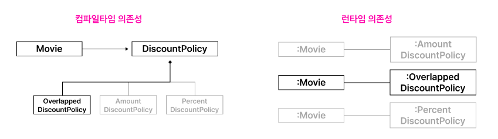
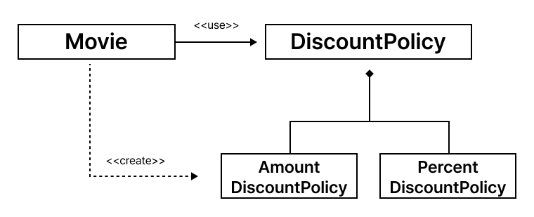
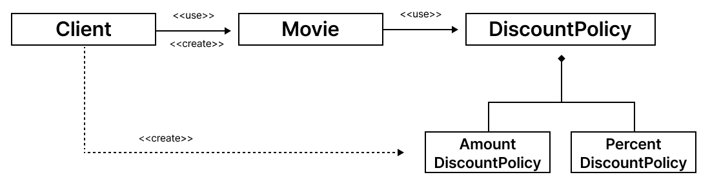
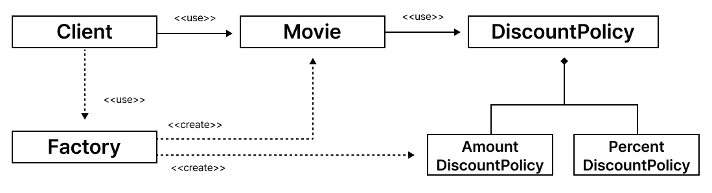
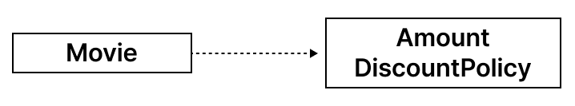
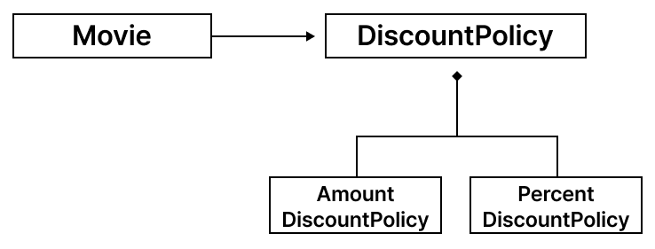
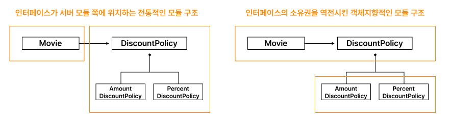

## 01. 개방-폐쇄 원칙

소프트웨어 개체(클래스, 모듈, 함수 등등)는 **확장**에 대해 열려 있어야 하고, **수정**에 대해서는 닫혀 있어야 한다.

- 확장에 대해 열려있다: 애플리케이션의 요구사항이 변경될 때 이 변경에 맞게 새로운 ‘동작’을 추가해서 애플리케이션의 기능을 확장할 수 있다
- 수정에 대해 닫혀있다: 기존의 ‘코드’를 수정하지 않고도 애플리케이션의 동작을 추가하거나 변경할 수 있다

### 컴파일타임 의존성을 고정시키고 런타임 의존성을 변경하라

- 컴파일타임 의존성: 코드에서 드러나는 클래스들 사이의 관계
- 런타임 의존성: 실행 시에 협력에 참여하는 객체들 사이의 관계

의존성 관점에서 개방-폐쇄 원칙을 따르는 설계란 컴파일타임 의존성은 유지하면서 런타임 의존성의 가능성을 확장하고 수정할 수 있는 구조



### 추상화가 핵심이다

**추상화**

문맥이 바뀌더라도 변하지 않는 부분만 남게 되고 문맥에 따라 변하는 부분은 생략

- 생략되지 않고 남겨지는 부분은 추상화의 결과물 → 수정에 대해 닫혀 있다
- 생략된 부분 → 확장의 여지를 남긴다

⇒ 추상화가 개방-폐쇄 원칙을 가능하게 만든다

```java
// DiscountPolicy
// 변하지 않는 부분: 할인 여부를 판단하는 로직
// 변하는 부분: 할인된 요금을 계산하는 방법
public abstract class DiscountPolicy {
    private List<DiscountCondition> conditions = new ArrayList<>();

    public DiscountPolicy(DiscountCondition... conditions) {
        this.conditions = Arrays.asList(conditions);
    }

    // 할인 여부를 판단해서 요금을 계산
    public Money calculateDiscountAmount(Screening screening) {
        for(DiscountCondition each: conditions) {
            if(each.isSatisfiedBy(screening)) {
                return getDiscountAmount(screening);
            }
        }
        
        return screening.getMovieFee();
    }
		
    // 조건을 만족할 때 할인된 요금을 계산하는 추상 메서드
    abstract protected Money getDiscountAmount(Screening screening);
}
```

- 개방-폐쇄 원칙에서 폐쇄를 가능하게 하는 것은 **의존성의 방향**
- 수정에 대한 영향을 최소화하기 위해서는 모든 요소가 추상화에 의존

```java
// Movie
// DiscountPolicy(할인 정책 추상화)에 대해서만 의존 -> 변하지 않는 추상화
// DiscountPolicy의 자식 클래스를 추가하더라도 영향을 받지 않음
// Movie와 DiscountPolicy는 수정에 대해 닫혀 있다
public class Movie {
	...
	private DiscountPolicy discountPolicy;
	
	public Movie(String title, Duration runningTime, Money fee, DiscountPolicy discountPolicy) {
		...
		this.discountPolicy = discountPolicy;
	}
	
	public Money calculateMovieFee(Screening screening) {
		return fee.minus(discountPolicy.calculateDiscountAmount(screening));
	}
}
```

- 추상화는 확장을 가능하게 하고 추상화에 대한 의존은 폐쇄를 가능하게 한다
- 명시적 의존성과 의존성 해결 방법을 통해 컴파일타임 의존성을 런타임 의존성으로 대체함으로써 실행 시에 객체의 행동을 확장할 수 있다

## 02. 생성 사용 분리

```java
public class Movie {
	...
	private DiscountPolicy discountPolicy;
	
	public Movie(String title, Duration runningTime, Money fee) {
		...
		this.discountPolicy = new AmountDiscountPolicy(...);
	}
	
	public Money calculateMovieFee(Screening screening) {
		return fee.minus(discountPolicy.calculateDiscountAmount(screening));
	}
}
```



- 유연하고 재사용 가능한 설계를 원한다면 객체와 관련된 두 가지 책임을 서로 다른 객체로 분리해야 한다
- 하나는 객체를 생성하는 것이고, 다른 하나는 객체를 사용하는 것
- 객체에 대한 **생성과 사용을 분리**해야 한다

⇒ 사용으로부터 생성을 분리하는 데 사용되는 가장 보편적인 방법은 객체를 생성할 책임을 클라이언트로 옮기는 것

```java
// Movie의 클라이언트가 적절한 DiscountPolicy 인스턴스를 생성한 후 Movie에게 전달
// Movie에게 금액 할인 정책을 적용할지, 비율 할인 정책을 사용할지 알고 있는 것은
// Movie와 협력할 Client
public class Client {
	public Money getAvatarFee() {
		Movie avatar = new Movie("아바타",
                            Duration.ofMinutes(120),
                            Money.wons(10000),
                            new AmountDiscountPolicy(...));		
		return avatar.getFee();
	}
}
```



### FACTORY 추가하기

- `Movie`를 사용하는 `Client`도 특정한 컨텍스트에 묶이지 않는다면

→ 기존 `Client`코드는 `Movie` 인스턴스를 생성하는 동시에 `getFee` 메시지도 함께 전송하고 있다

```java
// 객체 생성에 특화된 객체: FACTORY
// Movie와 AmountDiscountPolicy를 생성하는 책임
public class Factory {
	public Movie createAvatarMovie() {
		return new Movie("아바타",
                    Duration.ofMinutes(120),
                    Money.wons(10000),
                    new AmountDiscountPolicy(...));
	}
}
```

```java
// 사용과 관련된 책임
// 1) FACTORY를 통해 생성된 Movie 객체 얻기 위함
// 2) Movie를 통해 가격을 계산하기 위함
public class Client {
	private Factory factory;
	
	public Client(Factory factory) {
		this.factory = factory;
	}
	
	public Money getAvatarFee() {
		Movie avatar = factory.createAvatarMovie();
		return avatar.getFee();
	}
}
```



### 순수한 가공물에게 책임 할당하기

- 시스템을 객체로 분해하는 방식
    - 표현적 분해
    
    도메인에 존재하는 사물 또는 개념을 표현하는 객체들을 이용해 시스템을 분해하는 것
    
    - 행위적 분해
    
    책임을 할당하기 위해 창조되는 도메인과 무관한 인공적인 객체**(PURE FABRICATION)**
    
    → 행위적 분해에 의해 생성되는 것이 일반적
    

## 03. 의존성 주입

- 생성자 주입: 객체를 생성하는 시점에 생성자를 통해 의존성 해결

객체의 생명주기 전체에 걸쳐 관계를 유지 / 의존성을 전달받으면서 객체가 올바른 상태로 생성되는 데 필요한 의존성을 명확하게 표현할 수 있음

- setter 주입: 객체 생성 후 setter 메서드를 통한 의존성 해결

언제라도 의존 대상을 교체할 수 있다 / 어떤 의존성이 필수적인지를 명시적으로 표현할 수 없다

- 메서드 주입: 메서드 실행 시 인자를 이용한 의존성 해결

```java
// 생성자 주입
Mocie avartar = new Movie("아바타",
                          Duration.ofMinutes(120),
                          Money.wons(10000),
                          new AmountDiscountPolicy(...));
										
// setter 주입
avatar.setDiscountPolicy(new AmountDiscountPolicy(...));

// 메서드 주입
avatar.calculateDiscountAmount(screening, new AmountDiscountPolicy(...));
```

### 숨겨진 의존성은 나쁘다

의존성 주입 외에도 의존성을 해결할 수 있는 다양한 방법들이 존재

- **SERVICE LOCATOR 패턴**

외부에서 객체에게 의존성을 전달하는 의존성 주입과 달리 객체가 직접 SERVICE LOCATOR에게 의존성을 해결해줄 것을 요청

```java
public class Movie {
	...
	private DiscountPolicy discountPolicy;
	
	public Movie(String title, Duration runningTime, Money fee) {
		this.title = title;
		this.runningTime = runningTime;
		this.fee = fee;
		this.discountPolicy = ServiceLocator.discountPolicy();
	}
}
```

```java
// DiscountPolicy의 인스턴스를 등록하고 반환할 수 있는 메서드를 구현한 저장소
public class ServiceLocator {
	private static ServiceLocator soleInstance = new ServiceLocator();
	private DiscountPolicy discountPolicy;
	
	// 인스턴스 반환
	public static DiscountPolicy discountPolicy() {
		return soleInstance.discountPolicy;
	}
	
	// 인스턴스 등록
	public static void provide(DiscountPolicy discountPolicy) {
		soleInstance.discountPolicy = discountPolicy;
	}
	
	private ServiceLocator() {}
}
```

```java
ServiceLocator.provide(new AmountDiscountPolicy(...));
ServiceLocator.provide(new PercentDiscountPolicy(...));
Mocie avartar = new Movie("아바타",
                          Duration.ofMinutes(120),
                          Money.wons(10000));
```

<aside>
💡

**SERVICE LOCATOR 패턴**의 가장 큰 단점은 **의존성을 감춘다**는 것

숨겨진 의존성은 캡슐화를 위반한다

</aside>

```java
Mocie avartar = new Movie("아바타",
                      Duration.ofMinutes(120),
                      Money.wons(10000));
										 
// NullPointerException -> 디버깅하기가 쉽지 않음
avartar.calculateMovieFee(screening);
```

## 04. 의존성 역전 원칙

### 추상화와 의존성 역전

상위 수준 클래스인 `Movie`가 하위 수준 클래스인 `AmountDiscountPolicy`에 의존

```java
public class Movie {
	private AmountDiscountPolicy discountPolicy;
}
```



- 어떤 협력에서 중요한 정책이나 의사결정, 비즈니스의 본질을 담고 있는 것은 상위 수준의 클래스
- 상위 수준의 클래스가 하위 수준의 클래스에 의존한다면 하위 수준의 변경에 의해 상위 수준 클래스가 영향을 받게 된다

`Movie`와 `AmountDiscountPolicy` 모두가 추상화에 의존하도록 수정하면 하위 수준 클래스의 변경으로 인해 상위 수준의 클래스가 영향을 받는 것을 방지할 수 있다 ⇒ 추상화

- `Movie`는 추상 클래스인 `DiscountPolicy`에 의존 / `AmountDiscountPolicy`도 추상 클래스인 `DiscountPolicy`에 의존



<aside>
💡

**의존성 역전 원칙**

1. 상위 수준의 모듈은 하위 수준의 모듈에 의존해서는 안 된다. 둘 모두 추상화에 의존해야 한다.
2. 추상화는 구체적인 사항에 의존해서는 안 된다. 구체적인 사항은 추상화에 의존해야 한다.
</aside>

### 의존성 역전 원칙과 패키지



**전통적인 모듈 구조**

- `Movie`를 다양한 컨텍스트에서 재사용하기 위해서는 불필요한 클래스들이 함께 배포되어야 한다

**객체지향적인 모듈 구조**

- 추상화를 별도의 독립적인 패키지가 아니라 클라이언트가 속한 패키지에 포함시켜야 한다
- 함께 재사용될 필요가 없는 클래스들을 별도의 독립적인 패키지에 모아야 한다
- **SEPARATED INTERFACE 패턴**

## 05. 유연성에 대한 조언

### 유연한 설계는 유연성이 필요할 때만 옳다

- 유연성은 항상 복잡성을 수반한다
- 객체지향 코드에서 클래스의 구조는 발생 가능한 모든 객체 구조를 담는 틀
- 특정 시점의 객체 구조를 파악하는 유일한 방법은 클래스를 사용하는 클라이언트 코드 내에서 객체를 생성하거나 변경하는 부분을 직접 살펴보는 것

### 협력과 책임이 중요하다

- 설계를 유연하게 만들기 위해서는 먼저 역할, 책임, 협력에 초점
- 객체를 생성할 책임을 담당할 객체나 객체 생성 메커니즘을 결정하는 시점은 책임 할당의 마지막 단계로
- 중요한 비즈니스 로직을 처리하기 위해 책임을 할당하고 협력의 균형을 맞추는 것이 객체 생성에 관한 책임을 할당하는 것보다 우선
